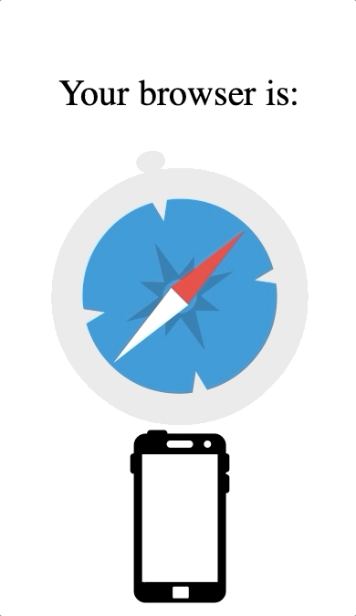

[](https://github.com/yankouskia/get-browser/pulls) [](https://github.com/yankouskia/get-browser/blob/master/LICENSE)

[](https://www.npmjs.com/package/get-browser)

# get-browser

💻 Lightweight tool to identify the browser (with mobile/desktop detection) 📱


| </br> Internet Explorer | </br> Microsoft Edge | </br> Mozilla Firefox | </br> Google Chrome | </br> Opera | </br> Safari | </br> Android WebView
| --- | --- | --- | --- | --- | --- | ---
| 7+ | 12+ | 5+ | 31+ | 18+ | 6+ | 20+


## Demo

[DEMO can be found here](https://yankouskia.github.com/get-browser/example)


Desktop Chrome            |  Mobile Safari
:-------------------------:|:-------------------------:
  |  

## Motivation

Lightweight tool for easy way to identify the browser. User Agent does not always provide entire information about the browser. Additional checks are used.

## How to use

To install library:

```sh
# yarn
yarn add get-browser

# npm
npm install get-browser --save
```

Library is designed to identify browser and device type (mobile / desktop)

```js
// ES6 modules
import {
  browsers,
  detect,
  isMobile,

  isAndroid,
  isChrome,
  isEdge,
  isFirefox,
  isIE,
  isOpera,
  isSafari,
} from 'get-browser';

// CommonJS modules
const {
  browsers,
  detect,
  isMobile,

  isAndroid,
  isChrome,
  isEdge,
  isFirefox,
  isIE,
  isOpera,
  isSafari,
} = require('get-browser');

// Enumeration with all supported browsers is provided:
console.log(browsers);
/*
{
  ANDROID: 'android',
  CHROME: 'chrome',
  EDGE: 'edge',
  FIREFOX: 'firefox',
  IE: 'ie',
  OPERA: 'opera',
  SAFARI: 'safari',
  UNKNOWN: 'unknown',
}
*/

// To detect browser:
const browser = detect(); // one from the browsers list will be displayed

// To detect whether mobile device is used:
const isMobileDevice = isMobile();

// To detect whether user is in Firefox browser:
const isFirefoxBrowser = isFirefox();

```

## API

`browsers`

Exposed enumeration for providing constant for each browser.

`detect(): string<oneof browsers>`

Returns the browser name

`isMobile(): boolean`

Returns true if mobile device is being used

`isAndroid(): boolean`

Return true if Android browser us being used

`isChrome(): boolean`

Return true if Google Chrome browser us being used

`isEdge(): boolean`

Return true if Edge browser us being used

`isFirefox(): boolean`

Return true if Firefox browser us being used

`isIE(): boolean`

Return true if Internet Explorer browser us being used

`isOpera(): boolean`

Return true if Opera browser us being used

`isSafari(): boolean`

Return true if Safari browser us being used


## Contributing

`get-browser` is open-source library, opened for contributions


### License

`get-browser` is [MIT licensed](https://github.com/yankouskia/get-browser/blob/master/LICENSE)
