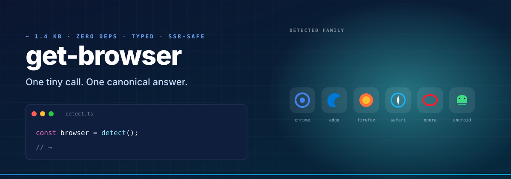

<p align="center">
  <a href="https://yankouskia.github.io/get-browser/">
    
  </a>
</p>

<h1 align="center">get-browser</h1>

<p align="center">
  <strong>Tiny, typed, SSR-safe browser detection.</strong><br />
  One call. One canonical answer. <strong>~1.4&nbsp;kB</strong> min+gzip. Zero dependencies.
</p>

<p align="center">
  <a href="https://www.npmjs.com/package/get-browser"></a>
  <a href="https://bundlephobia.com/package/get-browser"></a>
  <a href="https://github.com/yankouskia/get-browser/actions/workflows/ci.yml"></a>
  <a href="https://www.typescriptlang.org/"></a>
  <a href="https://github.com/yankouskia/get-browser/blob/master/LICENSE"></a>
</p>

<p align="center">
  <a href="https://yankouskia.github.io/get-browser/"><strong>📚 Docs site</strong></a> ·
  <a href="https://yankouskia.github.io/get-browser/playground"><strong>🧪 Playground</strong></a> ·
  <a href="https://yankouskia.github.io/get-browser/docs/recipes"><strong>🍳 Recipes</strong></a> ·
  <a href="https://yankouskia.github.io/get-browser/docs/migration"><strong>↗️ v1 → v2</strong></a>
</p>

---

```ts
import { detect, getOS, isMobile, browsers, oses } from 'get-browser';

if (detect() === browsers.SAFARI && isMobile()) {
  applyMobileSafariFix();
}

const shortcut = getOS() === oses.MACOS ? '⌘ K' : 'Ctrl K';
```

That's the whole pitch. `detect()` returns a strict browser union — `'chrome' | 'edge' | 'firefox' | 'safari' | 'opera' | 'ie' | 'android' | 'unknown'`. `getOS()` returns a strict OS union — `'macos' | 'windows' | 'linux' | 'ios' | 'android' | 'chromeos' | 'unknown'`. A handful of tree-shakeable predicates do the boolean versions.

## Install

```sh
pnpm add get-browser    # or npm / yarn / bun
```

No bundler? Drop in the UMD bundle:

```html
<script src="https://unpkg.com/get-browser/dist/umd/get-browser.global.js"></script>
<script>
  if (GetBrowser.isMobile()) document.body.classList.add('is-mobile');
</script>
```

## Why you'd use this

- 🪶 **Tiny** — ~1.4 kB min+gzip, zero dependencies, tree-shakeable.
- 🧠 **Typed** — `detect()` returns the `Browser` union, never `string`. Exhaustive switches compile.
- 🏗️ **SSR-safe** — every detector takes `{ userAgent }`. Works in Node, Next.js, Remix, Astro, Workers, Deno.
- 🎯 **Honest** — it answers *who*, not *what*. For capability checks use `@supports` / `matchMedia`.

> [!TIP]
> Want to see it in action without installing anything? Open the **[Playground](https://yankouskia.github.io/get-browser/playground)** — paste any user-agent and watch every predicate light up.

## Usage

<details open>
<summary><strong>Switch on the browser</strong></summary>

```ts
import { detect, browsers } from 'get-browser';

switch (detect()) {
  case browsers.CHROME:  loadChromeShim();          break;
  case browsers.SAFARI:  patchSafariScrollBug();    break;
  case browsers.FIREFOX: enableFirefoxOnlyFeature(); break;
  case browsers.UNKNOWN: /* bot or new browser */    break;
}
```

</details>

<details>
<summary><strong>Booleans — tree-shakes to ~400 bytes per predicate</strong></summary>

```ts
import { isMobile, isChrome, isSafari } from 'get-browser';

if (isMobile() && !isChrome()) showNonChromeMobileBanner();
if (isSafari() && isMobile()) applyMobileSafariFix();
```

</details>

<details>
<summary><strong>Server-side — Next.js, Remix, Workers, Deno</strong></summary>

```ts
// Next.js Edge route — runs on Cloudflare too
export const runtime = 'edge';

import { detect, getOS } from 'get-browser';

export function GET(req: Request) {
  const userAgent = req.headers.get('user-agent') ?? '';
  return Response.json({
    browser: detect({ userAgent }),
    // Prefer Sec-CH-UA-Platform — Chrome's UA Reduction is hollowing
    // out the legacy UA string. Get-browser reads either.
    os: getOS({
      userAgent,
      clientHints: { platform: req.headers.get('sec-ch-ua-platform') ?? undefined },
    }),
  });
}
```

The library never touches `window` at import time. Pass an explicit UA and detection becomes a pure function — perfect for tests and SSR. Full framework cookbook in the [SSR guide](https://yankouskia.github.io/get-browser/docs/guides/ssr).

</details>

<details>
<summary><strong>Cross-platform UI — shortcuts, downloads, deep links</strong></summary>

```ts
import { getOS, oses } from 'get-browser';

const os = getOS();

const shortcut    = os === oses.MACOS ? '⌘ K' : 'Ctrl K';
const downloadUrl = os === oses.WINDOWS ? '/dl/app.exe'
                  : os === oses.MACOS   ? '/dl/app.dmg'
                  : os === oses.LINUX   ? '/dl/app.deb'
                  : '/dl/';
const storeUrl    = os === oses.IOS     ? 'https://apps.apple.com/…'
                  : os === oses.ANDROID ? 'https://play.google.com/…'
                  : '/install';
```

</details>

<details>
<summary><strong>In-app browsers — Instagram, Facebook, TikTok, X, LinkedIn, …</strong></summary>

```ts
import { isInAppBrowser } from 'get-browser';

// OAuth providers (Google, Apple, Microsoft) block sign-in inside
// most in-app browsers. Bounce to the system browser first.
if (isInAppBrowser()) {
  showOpenInBrowserBanner({
    message: 'Tap ⋯ → "Open in browser" to continue with Google sign-in.',
  });
}
```

Catches Facebook (`FBAN`/`FBAV`/`FB_IAB`), Instagram, X/Twitter, LinkedIn, TikTok, Snapchat, WeChat, Line, Telegram, Pinterest. Stable token-based matching — version-agnostic.

</details>

<details>
<summary><strong>Type-safe analytics tagging</strong></summary>

```ts
import { type Browser, detect } from 'get-browser';

const engineOf = (b: Browser) =>
  ({
    chrome: 'chromium', edge: 'chromium', opera: 'chromium',
    firefox: 'gecko',   safari: 'webkit', ie: 'trident',
    android: 'legacy-webkit', unknown: 'unknown',
  } as const)[b];

analytics.track('page_view', { engine: engineOf(detect()) });
```

If a future major bumps `Browser`, the compiler refuses to build. No silent drift.

</details>

## API

A small surface — every export pulls its weight.

| | |
| --- | --- |
| `detect(opts?)` | Returns one of the [`browsers`](https://yankouskia.github.io/get-browser/docs/api/browsers) values |
| `getOS(opts?)` | Returns one of the [`oses`](https://yankouskia.github.io/get-browser/docs/api/get-os) values |
| `isChrome / isEdge / isFirefox / isSafari` | `(opts?) => boolean` |
| `isOpera / isIE / isAndroid / isMobile` | `(opts?) => boolean` |
| `isInAppBrowser` | `(opts?) => boolean` — `true` inside Instagram, Facebook, TikTok, X, LinkedIn, … |
| `browsers`, `oses` | Frozen enums: `{ CHROME: 'chrome', ... }`, `{ MACOS: 'macos', ... }` |
| `Browser`, `OS`, `DetectOptions`, `ClientHints` | Type-only exports |

`opts` is `{ userAgent?: string; vendor?: string; clientHints?: { platform?: string } }` — pass `userAgent` for SSR or tests, pass `clientHints.platform` (the `Sec-CH-UA-Platform` header) for the most reliable OS read.

**[Full API reference →](https://yankouskia.github.io/get-browser/docs/api/detect)**

## How it stacks up

| Bundle (min+gz) | get-browser | detect-browser | bowser | ua-parser-js |
| --- | :-: | :-: | :-: | :-: |
| | 🏆 **~1.4 kB** | ~2 kB | ~7 kB | ~10 kB |

Pick `ua-parser-js` if you need version numbers or device info. Pick `get-browser` if you just need the single, lowercase, typed answer to *which browser is this?* — see [the full comparison](https://yankouskia.github.io/get-browser/docs/comparison).

## What it detects

<p align="center">
  
  
  
  
  
  
  
  
</p>

Chrome, Edge (legacy & Chromium), Firefox, Safari (desktop, iOS, iPadOS), Opera (Presto & OPR), Internet Explorer 6-11, Android WebView — including iOS variants (`CriOS`, `FxiOS`, `EdgiOS`) and mobile / tablet user-agents. Coverage details: [browser support](https://yankouskia.github.io/get-browser/docs/browser-support).

## Requirements

- **Node ≥ 20** (active LTS — 20, 22, 24)
- **TypeScript ≥ 5.0** if you use types
- **Browsers** — evergreen. UMD bundle is ES2018.

## Documentation

The full docs are built with [Docusaurus](https://docusaurus.io/) and deployed to GitHub Pages:

| 📚 [Docs](https://yankouskia.github.io/get-browser/docs/intro) | 🔌 [API](https://yankouskia.github.io/get-browser/docs/api/detect) | 🧪 [Playground](https://yankouskia.github.io/get-browser/playground) | 🍳 [Recipes](https://yankouskia.github.io/get-browser/docs/recipes) | 🏗️ [SSR](https://yankouskia.github.io/get-browser/docs/guides/ssr) | 🔄 [Migration](https://yankouskia.github.io/get-browser/docs/migration) |
| :-: | :-: | :-: | :-: | :-: | :-: |

Run the docs locally:

```sh
pnpm install
pnpm run build              # build the library first
pnpm run website:install
pnpm run website:dev        # http://localhost:3000
```

## Contributing & license

PRs welcome — see [`CONTRIBUTING.md`](./CONTRIBUTING.md). For security issues, see [`SECURITY.md`](./SECURITY.md) (please don't open public issues for vulnerabilities).

[MIT](./LICENSE) © yankouskia and contributors.
