# Browser support

`get-browser` recognizes the families that account for >99% of public web traffic in 2026.

## Recognized browsers

| Family | What `detect()` returns | UA tokens matched |
| --- | --- | --- |
| **Google Chrome** | `'chrome'` | `Chrome/` (desktop, Android), `CriOS/` (iOS), `Chromium/` (Brave, Vivaldi, …) |
| **Microsoft Edge** | `'edge'` | `Edge/` (legacy EdgeHTML), `Edg/` (Chromium-Edge desktop), `EdgA/` (Android), `EdgiOS/` (iOS) |
| **Mozilla Firefox** | `'firefox'` | `Firefox/`, `FxiOS/` (Firefox iOS) |
| **Apple Safari** | `'safari'` | `Safari/` with Apple vendor — excludes `CriOS`, `FxiOS`, `EdgiOS`, `OPiOS` |
| **Opera** | `'opera'` | `Opera/` (Presto), `OPR/` (Chromium-Opera), `window.opera` / `window.opr` |
| **Internet Explorer** | `'ie'` | `MSIE ` (6–10), `Trident/` (11) |
| **Android WebView** | `'android'` | `Android` + `Mozilla/5.0` + `AppleWebKit` (without any of the above) |
| **Anything else** | `'unknown'` | Empty UA, bots, brand-new browsers |

## Version coverage

The detection logic keys on **stable family tokens**, not version numbers. As long as Chrome calls itself `Chrome/`, Edge calls itself `Edg/`, and so on, version bumps don't affect correctness. The fixture suite locks in:

- Chrome 131, 140
- Edge 131, 140
- Firefox 122, 138
- Safari 17, 18, 26
- Opera 117

Including iOS / Android / Windows / macOS / Linux variants for each.

## Mobile coverage

`isMobile()` matches the common mobile / tablet tokens — iPhone, iPod, iPad, Android+Mobile, BlackBerry, webOS, Symbian, Maemo, Windows CE, Opera Mini, Opera Mobi, and many others. See the [`isMobile()` API page](./api/is-mobile) for the full list.

### iPadOS gotcha

Since iPadOS 13 (2019), iPad's default Safari UA looks **exactly like macOS Safari**. There is no reliable way to tell them apart from the UA alone. We catch iPads only when the user toggles "Request Mobile Website" or when an in-app WebView preserves the `iPad` token. See [`isSafari()` notes](./api/is-safari#ipados-gotcha).

## Detection ordering

`detect()` walks the families **most-specific-first** to disambiguate Chromium siblings:

```mermaid
flowchart TD
  A[detect&#40;userAgent&#41;] --> B{Edge?}
  B -- yes --> Z1[return 'edge']
  B -- no --> C{Opera?}
  C -- yes --> Z2[return 'opera']
  C -- no --> D{IE?}
  D -- yes --> Z3[return 'ie']
  D -- no --> E{Firefox?}
  E -- yes --> Z4[return 'firefox']
  E -- no --> F{Chrome / Chromium?}
  F -- yes --> Z5[return 'chrome']
  F -- no --> G{Safari?}
  G -- yes --> Z6[return 'safari']
  G -- no --> H{Android WebView?}
  H -- yes --> Z7[return 'android']
  H -- no --> Z8[return 'unknown']
```

This matters because Chromium-Edge advertises both `Chrome/` and `Edg/`. Without ordering, `detect()` would have to make a tie-breaker call. Running `isEdge` first guarantees Edge wins.

## What's not supported

- **Version numbers.** Use [`ua-parser-js`](https://www.npmjs.com/package/ua-parser-js) or [`bowser`](https://www.npmjs.com/package/bowser).
- **OS detection.** Same recommendation.
- **Bots, crawlers.** Most identify themselves with a name like `Googlebot/2.1` — for those, regex the UA directly.
- **Smart TVs, game consoles, embedded WebViews.** Most resolve to the underlying engine (Chrome, Safari) or `'unknown'`.

## See also

- [Comparison with alternatives](./comparison)
- [API: `detect()`](./api/detect)
