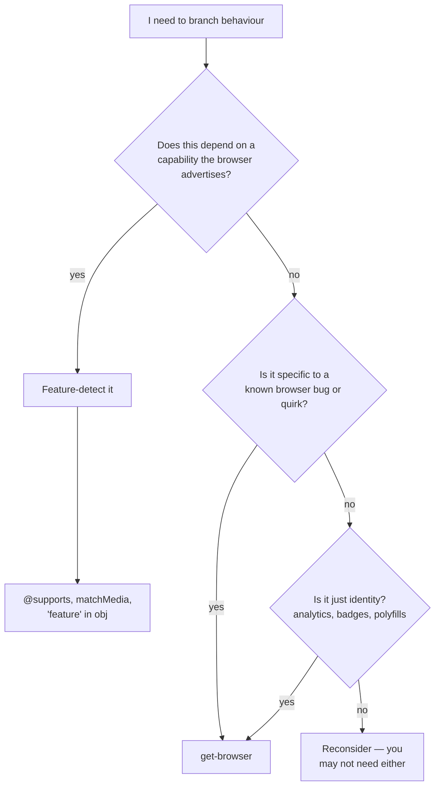

# Feature detection vs UA sniffing

UA sniffing is a tool of last resort. Most of the time, the thing you actually want is **feature detection** — asking the browser "do you support X?" instead of "which one are you?".




## Prefer feature detection when…

You want to know if a capability is available. The browser is the source of truth — if it says the API exists, use it.

```ts
// ✅ feature detection
if ('share' in navigator) {
  navigator.share({ url: location.href });
}

// ❌ UA sniffing for the same question
import { isSafari, isMobile } from 'get-browser';
if (isSafari() && isMobile()) navigator.share({ url: location.href });
```

| Question | Tool |
| --- | --- |
| Does this browser support CSS `subgrid`? | `CSS.supports('grid-template-rows', 'subgrid')` |
| Does this browser support the Web Share API? | `'share' in navigator` |
| Is this a touch-first device? | `matchMedia('(pointer: coarse)').matches` |
| Is the user in dark mode? | `matchMedia('(prefers-color-scheme: dark)').matches` |
| Is the viewport narrow? | `matchMedia('(max-width: 768px)').matches` or a CSS `@media` rule |
| Does this browser support `view-transition-name`? | `CSS.supports('view-transition-name', 'foo')` |

## Reach for `get-browser` when…

You actually need to know the **identity** of the browser, not the capability. The realistic list:

1. **You're working around a known browser bug.** Bug is fixed by version `X`; the same browser without the bug is also affected. Feature detection won't tell you about the bug — only the identity will.

   ```ts
   import { isSafari } from 'get-browser';
   if (isSafari()) document.body.classList.add('safari-scroll-anchor-fix');
   ```

2. **You're choosing a polyfill.** Some polyfills are heavy enough that you want to ship them only to browsers that need them. UA sniffing lets you do that at request time, before the polyfill code is fetched.

3. **You're rendering a "Download for your browser" badge.** Pure cosmetic, identity-driven.

4. **You're tagging analytics.** "What % of our users are on mobile Safari?" — UA is the signal.

5. **You're routing based on the request UA on the server.** No `window` yet, but you have the `User-Agent` header. See the [SSR guide](./ssr).

## The middle ground: progressive enhancement

When you don't know if a feature exists, you can chain detection:

```ts
import { isSafari } from 'get-browser';

if (CSS.supports('view-transition-name', 'foo')) {
  // modern path
  startViewTransition(updateDOM);
} else if (isSafari()) {
  // Safari-specific fallback
  applySafariFallback();
} else {
  // generic fallback
  updateDOM();
}
```

This is a fine pattern: feature detection is preferred, UA sniffing is the *named* fallback.

## A test you can apply

:::tip The reversibility test
_"If a future version of this browser stopped having this issue, would my code still work?"_

- **Yes** — use feature detection.
- **No** — UA sniffing is legitimately the right tool.
:::

## See also

- [`detect()` API](/docs/api/detect)
- [Recipes](/docs/recipes)
